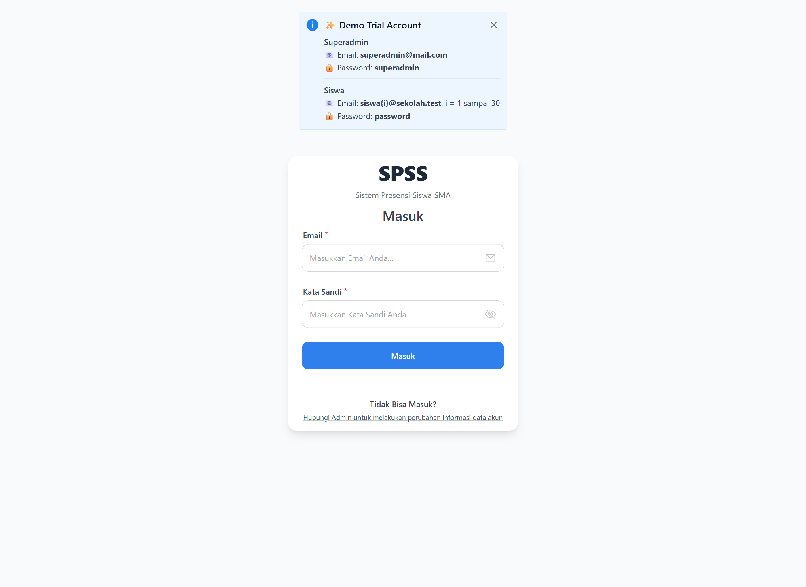
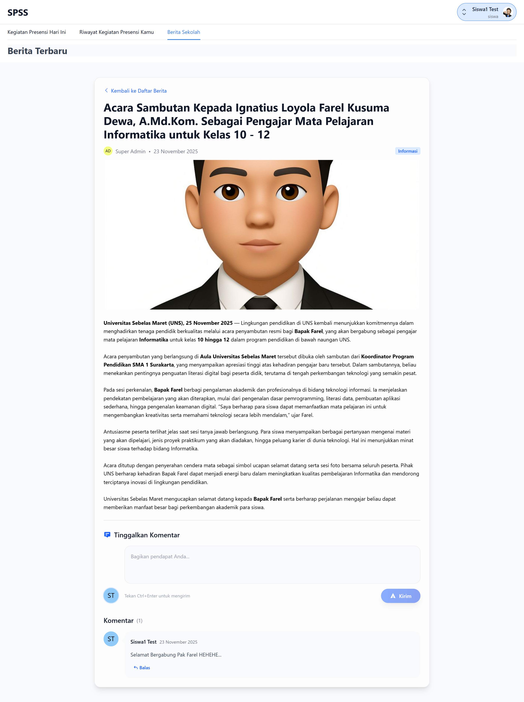

# **SPSS - Sistem Informasi Presensi Siswa SMA** 📦

> **Full-Stack Practice Project** </> 🤖 – Backend menggunakan **Laravel 10** & Frontend menggunakan **Vue 3**, dengan inspirasi desain UI diambil dari [Figma Community](https://www.figma.com/community/file/1263061341208887608/spps-sistem-pengelola-presensi-siswa) 🤝

---

## **1. Gambaran Produk** 🌐
**SPSS** adalah Sistem Informasi Presensi Siswa SMA berbasis web yang memudahkan proses presensi dan administrasi data siswa di lingkungan Sekolah Menengah Atas (SMA) secara efisien, akurat, dan real-time. Sistem ini berfungsi sebagai solusi digital untuk menggantikan metode pencatatan presensi manual yang sering kali memakan waktu dan rentan terhadap kesalahan. SPSS mengotomatisasi proses presensi, pelacakan data kehadiran, dan pembuatan laporan komprehensif, sehingga memudahkan pihak sekolah (guru, wali kelas, dan staf administrasi) serta siswa dalam mengakses informasi terkait kehadiran..

Beberapa fitur utama:
* **Login & Perubahan Informasi Data Akun**
* **Melakukan Presensi Hari Ini & Riwayat Presensi**
* **Daftar Siswa**
* **Daftar Pengurus**
* **Daftar Kelas**
* **Daftar Berita**
* **Daftar Laporan**

---

## **2. Prasyarat Sistem** ⚙️

* **PHP**: ^8.2
* **Composer**: ^2.x
* **Node.js**: ^18.x
* **NPM**: ^9.x
* **MySQL**: ^8.x
* **Git**: ^2.x

---

## **3. Instalasi Backend (Laravel 10)**

1. **Clone repository backend**

   ```bash
   git clone https://github.com/IgnatiusFarel/spss.git
   cd backend
   ```

2. **Install dependencies**

   ```bash
   composer install
   ```

3. **Buat file environment**

   ```bash
   cp .env.example .env
   ```

4. **Konfigurasi database di `.env`**

   ```env
   DB_CONNECTION=mysql
   DB_HOST=127.0.0.1
   DB_PORT=3306
   DB_DATABASE=simatik
   DB_USERNAME=root
   DB_PASSWORD=
   ```

5. **Generate application key**

   ```bash
   php artisan key:generate
   ```

6. **Migrasi & seed database**

   ```bash
   php artisan migrate --seed
   ```

7. **Jalankan server backend**

   ```bash
   php artisan serve
   ```

   Backend berjalan di: **[http://127.0.0.1:8000](http://127.0.0.1:8000)**

---

## **4. Instalasi Frontend (Vue.js 3 + Vite)**

1. **Clone repository frontend**

   ```bash
   git clone https://github.com/IgnatiusFarel/spss.git
   cd frontend
   ```

2. **Install dependencies**

   ```bash
   npm install
   ```

   atau

   ```bash
   yarn install
   ```

3. **Buat file `.env`**

   ```env
   VITE_API_BASE_URL=http://127.0.0.1:8000/api
   ```

4. **Jalankan development server**

   ```bash
   npm run dev
   ```

   Frontend berjalan di: **[http://127.0.0.1:5173](http://127.0.0.1:5173)**

---

## **5. Tampilan Menu 🖼**

### **5.1 Login**



### **5.2 Perubahan Informasi Data Akun**


### **5.3 Presensi Hari Ini**


### **5.4 Riwayat Presensi**


### **5.5 Daftar Siswa**


### **5.6 Daftar Pengurus**


### **5.7 Daftar Kelas**


### **5.8 Daftar Berita**


### **5.9 Daftar Laporan**


### **5.10 Kegiatan Presensi Siswa**


### **5.11 Riwayat Kegiatan Presensi Siswa**


### **5.12 Berita Sekolah**



---

## **6. Teknologi yang Digunakan** 🛠

**Backend**

* Laravel 10
* Sanctum (API Authentication)
* Maatwebsite Excel (Export Excel)

**Frontend**

* Vue.js 3
* Vue Router 4
* Pinia (State Management)
* Naive UI (UI Framework)
* Axios (HTTP Client)
* Day.js (Date Handling)
* Phospor Icons Vue (Icons)
* Tailwind CSS (Framework CSS)
* Leaflet (Interactive Map)
* File Saver (File Storage)

**Database**

* MySQL (relational database)

---

## **7. Struktur Folder**

```
spss/
├── backend/ (Laravel)
│   ├── app/
│   ├── config/
│   ├── database/
│   ├── routes/
│   └── .env
│
└── frontend/ (Vue.js)
    ├── src/
    ├── public/
    ├── vite.config.js
    └── .env
```

---

## **8. Lisensi**

Proyek ini dibuat untuk keperluan pembelajaran.
Inspirasi UI diambil dari [Figma Community](https://www.figma.com/community/file/1263061341208887608/spps-sistem-pengelola-presensi-siswa).

---